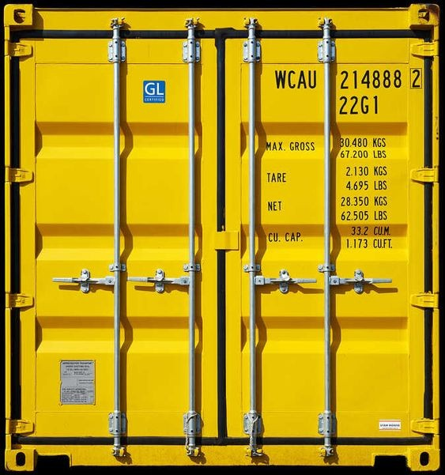
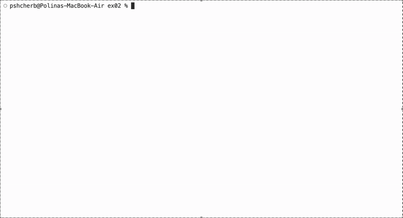
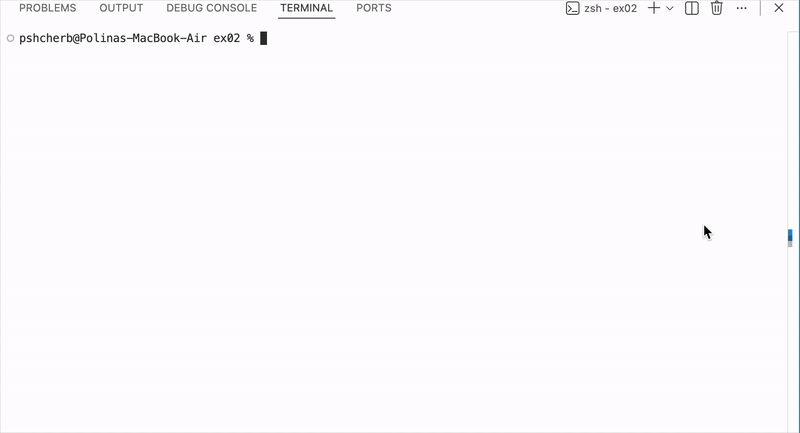

## 3 compact programs in C++ 

## Exploring how STL and algoritms behave in real-world data processing

A set of small programs focused on data processing using STL containers.
The goal is to pick the most efficient algorithm for each specific exercise.
It includes performance-comparison scripts, some parsing logic, and the use of various algorithms.

## Exercise 00: Bitcoin Exchange

## A tiny C++98 tool that reads real Bitcoin prices and tells you how much your old transactions would be worth today.

This data-processing mini-project loads historical Bitcoin prices, parses user input, validates it, and finds the closest matching price in the dataset.

Here is the data that we are going to feed out program with:

The input file containing values that we need to convert and dates:

The program in action:

I built it because it’s a great project to show how to choose the right container (map, vector, etc.), how to organize data in memory, and how to work with large files without losing performance.

## Exercise 01: Reverse Polish Notation

## A simple RPN expression evaluator

This program takes a raw expression, validates its format, and computes the result. The goal is to experiment with the container choice. Finaly, I chose stack-based approach. Why? Because RPN is literally designed for stacks: every number gets pushed, every operator pops the last two values, applies the operation, and pushes the result back. 

The program in action:

## Exercise 02: PmergeMe

## A program that takes a positive integer sequence as an argument and sorts it using the merge-insertion sort algorithm.

This one was definitely my favorite and also the most challenging. I used this [article](https://dev.to/emuminov/human-explanation-and-step-by-step-visualisation-of-the-ford-johnson-algorithm-5g91) to guide me through the algorithm. I created [oldmane.cpp](./resources/oldmane.cpp), but I realized it was incorrect. The number of comparisons was too high. I mean that you should sort 21 numbers in a maximum of 66 comparisons, for example. I spent a month trying to figure it out. This error helped me understand the algorithm better. I looked at Knuth's [explanation](https://warwick.ac.uk/fac/sci/dcs/teaching/material-archive/cs341/fj.pdf). This time, I finally got it. 

